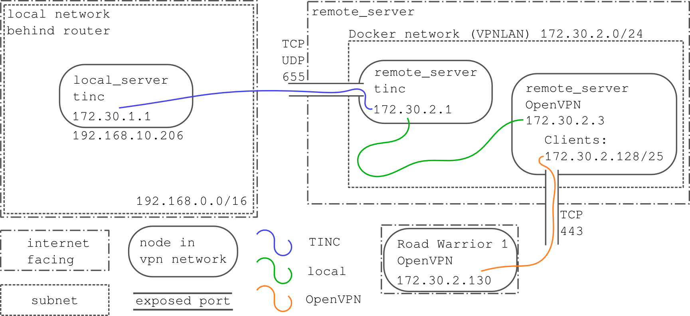

# vpn_infrastructure

This repository contains helper scripts I created to help setup my VPN
infrastructure. My goal was to be able to reach a local server behind a
residential router from my [road warriors](road_warrior).

For connecting the Linux based machines in my network I use [tinc](tinc). Some
road warriors are not capable of running tinc and rely on [OpenVPN](openvpn) to
gain access to the network.

The ip addresses and configuration files in this repository should correspond
to the diagram:

This is slightly simplified, only one OpenVPN server is drawn. The files in this
repository actually start two OpenVPN servers:
 * On port 1194 using UDP (OpenVPN's standard configuration, prefered)
 * On port 443 using TCP (Closely mimics https traffic to get through firewalls)

## Setup
[Docker][docker] is used on the remote server for easy deployment. All files
that are required on the remote server are placed in the server directory. The
clients directory contains example configurations, there is a script provided
that generates [`.mobileconfig`](mobileconfig_apple_docs) files that create a
VPN configuration profile for iOS that provides on-demand functionality. This
allows configuration such that the device always tries to connect and route
through the VPN connection.

## License

MIT License, see [LICENSE](LICENSE).

Copyright (c) 2017 Ivor Wanders

[road_warrior](https://en.wikipedia.org/wiki/Road_warrior_(computing))
[tinc](https://www.tinc-vpn.org/)
[openvpn](https://openvpn.net/)
[docker](https://www.docker.com/)
[mobileconfig_apple_docs](https://developer.apple.com/library/content/documentation/NetworkingInternet/Conceptual/iPhoneOTAConfiguration/Introduction/Introduction.html)